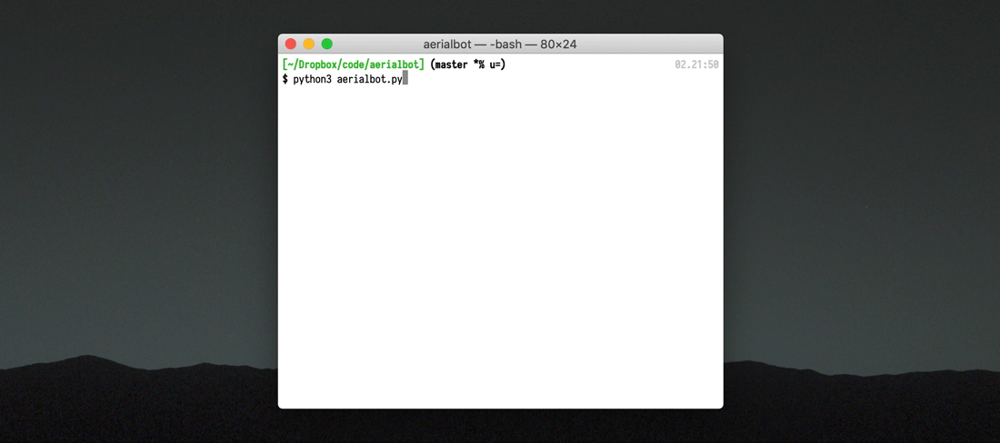

# ærialbot

*A simple bot that tweets geotagged aerial imagery of a random location in the world.*

---

In a bit more detail, whenever you run ærialbot, it...

* **loads a shapefile** from disk,
* generates a **random point**꙳ within the bounds of this shape,
* figures out **which map tiles need to be downloaded** to cover a certain area around the point in sufficient꙳ detail,
* **downloads those map tiles** from a provider of your choice real fast (a threadpool is involved!),
* **stitches** them together and **crops** the resulting image to precisely match the configured area,
* **saves** that to disk,
* and **tweets** the image, optionally with a geotag.

#### Check out [@americasquared](https://twitter.com/americasquared), an instance of ærialbot that tweets a satellite view of a randomly selected square mile of the United States every 4 hours!

![One square mile each, somewhere in the United Sates, centered around (from top left to bottom right): 31.056747601478456,-89.61225567756193; 26.44943037843055,-97.69999657039938; 39.32223925968352,-95.06302508257909; 33.830621832157895,-102.7345327711916; 46.149781016546264,-108.95292330126662; 20.755048248172997,-156.98230879693344; 41.21859102806858,-83.97344375576749; 36.89466223259036,-89.52366337871948; 36.07100491499848,-115.26963797305373; 42.87888803844798,-113.90920385179305; 33.90737575723908,-113.46512478011427; 45.009510867796266, -117.01147828430616](example.jpg)


## Features

Here's why ærialbot is a [Good Bot](https://www.reddit.com/r/OutOfTheLoop/comments/6oca11/what_is_up_with_good_bot_bad_bot_comments/):

* **Configurability:** Take a look at `config.sample.ini` – you can supply your own shapefile (or instead define a fixed point), control output verbosity, set a different map tile provider, define the filenames of the result images, scale them to your preferred size, define the text of the tweet, and more!
* ꙳**Correctness:** Because neighboring meridians are closer at the poles than at the equator, uniformly sampling the allowable range of latitudes would bias the generated random points toward the poles. Instead, ærialbot makes sure they are distributed with regard to surface area. For the same reason (plus the Mercator projection), the number of map tiles required to cover an area depends on the latitude – ærialbot accounts for this, too.
* ꙳**Automatic zoom level determination:** Simply define the dimensions of the desired area around the generated point – ærialbot will then take care of dialing in a (more than) sufficient zoom level.
* **Comes with batteries included:** The `shapefiles/` directory contains a number of shapefiles to get you started, along with a guide on preparing further shapefiles for use with ærialbot.
* **Tile grabbing performance:** Multiple map tiles are downloaded in parallel, and there's a snazzy progress indicator (as you can see in the GIF below) to keep you updated on the download progress.
* **Geotagging:** Tweets will be geotagged with the precise location – you can disable this, of course.
* **Logging:** Keeps a log file – whether that's for debugging or reminiscing is your call. Again, you can disable this easily.

*Side note:* If that's all a bit much for you, check out [gomati](https://github.com/doersino/gomati), my previous (and much more basic) implementation of a Google Maps tile downloader and stitcher.




## Usage

### Setup

Being a good [Python 3](https://www.python.org) citizen, ærialbot uses `venv` to avoid dependency hell. Run the following commands to get it installed on your system:

```bash
$ git clone https://github.com/doersino/aerialbot
$ python3 -m venv aerialbot
$ cd aerialbot
$ source bin/activate
$ pip3 install -r requirements.txt
```

(To deactivate the virtual environment, run `deactivate`.)


### Configuration

Copy `config.sample.ini` to `config.ini`, open it and modify it based on the (admittedly wordy) instructions in the comments.


### Running

Once you've set everything up and configured it to your liking, run:

```bash
$ python3 aerialbot.py
```

That's basically it!

If you want your bot to tweet at predefined intervals, use `cron`, [`runwhen`](http://code.dogmap.org/runwhen/) or a similar tool. To make `cron` work with `venv`, you'll need to use bash and execute the `activate` script before running ærialbot (in this example, it runs every four hours at 30 minutes past the hour):

```
30 */4 * * * * /usr/bin/env bash -c 'cd /PATH/TO/aerialbot && source bin/activate && python3 aerialbot.py'
```

*Pro tip:* If you want to host multiple instances of ærialbot, you don't need multiple copies of the code – multiple config files suffice: simply run `python3 aerialbot.py one-of-your-config-files.ini`.


## FAQ

### Why the name?

Because it's cute and I like the "æ" ligature.

### Why did you make this tool?

Because satellite imagery [can be extremely beautiful](https://earthview.withgoogle.com), and I was looking for a way of regularly receiving high-resolution satellite views of arbitrary locations such as [the center pivot irrigation farms of the American heartland](http://www.thegreatamericangrid.com/archives/1441) or squares of the [Jefferson grid](https://kottke.org/15/08/the-jefferson-grid) in my Twitter timeline.

Note that I've built this tool during the COVID-19 pandemic – when it was, you know, just kinda nice to see the great outdoors *somehow*.

### Does this violate Google's terms of use?

*(That's only relevant if you configure ærialbot to download tiles from Google Maps, which is the default source – but other tile providers do exist.)*

Probably. I haven't checked. But they haven't banned my IP for downloading tens of thousands of map tiles during development and testing, so you're probably good as long as you don't use this tool for downloading a centimeter-scale map of your country. What's more, I can't think of how an ærialbot-based Twitter bot would compete with or keep revenue from any of Google's products. (And it's always worth keeping in mind that Google is an incredibly profitable company that earns the bulk of its income via folks like you just going about their days surfing the ad-filled web.)

### Is there a [relevant XKCD](https://www.reddit.com/r/RelevantXKCD/)?

[You bet.](https://xkcd.com/1169/)

### Something is broken – can you fix it?

Possibly. Please feel free to [file an issue](https://github.com/doersino/aerialbot/issues) – I'll be sure to take a look!

## Future Work

*These are ideas more than anything else – don't expect them to be implemented any time soon.*

* Retry tile downloads once or twice if they fail – sometimes, packets just get lost forever even when using TCP, and it would be a shame to give up because of that if a bunch of tiles have already been downloaded successfully.
* In addition to `GeoShape.random_geopoint`, also implement a `Shape.random_edge_geopoint` function for generating points on the edge of polygons (and polylines), and make it available via a config setting. This would 1. help test whether a given shapefile is accurate (and whether its projection is suitable), and 2. enable tweeting images of coasts or border regions, which might be interesting.
* Similarly, if a shapefile with (multi)points instead of a polygon or polyline is given, randomly select a location among those points. This could be used to set up a Twitter bot that tweets landmarks belonging to a certain category around the world (if such data is publicly available, that is – I'm sure [OSM data](https://wiki.openstreetmap.org/wiki/Shapefiles) could be filtered accordingly).
* Commission [@smolrobots](https://twitter.com/smolrobots/status/1224096411056320514) to draw a little mascot – maybe a satellite with a camera, or planet earth taking a selfie.
* Maybe split `aerialbot.py` up into multiple modules, take inspiration from [here](https://github.com/joaquinlpereyra/twitterImgBot).
* Set up a...
    * ... Japan-focused instance at @nihonmugenkei (?) with screen name "日本∞景", i.e. "infinite views of Japan" in reference to [Hiroshige's series of 100 woodblock prints](https://en.wikipedia.org/wiki/One_Hundred_Famous_Views_of_Edo).
    * ... Korea-focused instance at @baekmanpyeong with screen name "백만평" in reference to the traditional area unit [Pyeong](https://en.wikipedia.org/wiki/Pyeong), which corresponds to 3.3058 m², meaning that a square comprising a million (baekman) Pyeong would be 1.818 kilometers on each side.
    * ... "worldwide" instance, maybe around 5 kilometers square.
    * ...n instance based on a shapefile containing the world's train tracks, if that's even publicly available (I'm sure [OSM data](https://wiki.openstreetmap.org/wiki/Shapefiles) could be filtered accordingly). Perhaps this would benefit from implementing a rotation feature.
